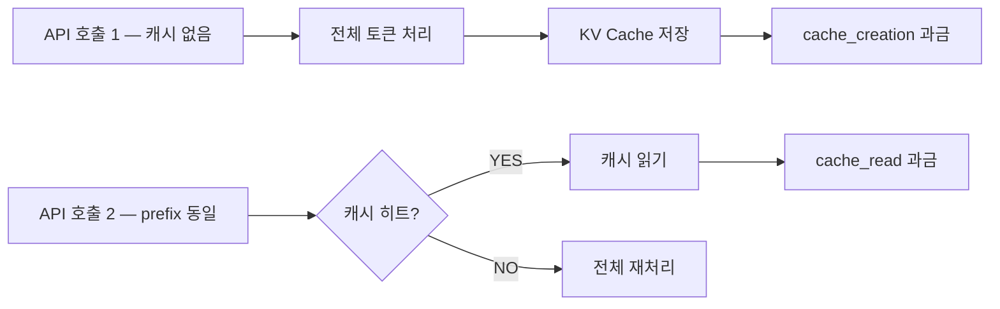

# Claude Prompt Caching — API 비용을 줄이는 실전 전략

Claude API는 요청마다 시스템 프롬프트와 대화 히스토리를 전부 다시 처리한다

시스템 프롬프트가 길어질수록, 대화가 이어질수록 입력 토큰이 계속 쌓이고
매 호출마다 그 토큰을 처음부터 다시 계산하니 비용도 그만큼 선형으로 늘어난다

Prompt Caching은 반복되는 프롬프트 앞부분을 캐시에 저장해두고
다음 호출에서 같은 prefix가 오면 재계산 없이 그대로 읽어온다

캐시를 읽을 때는 새로 계산할 때보다 훨씬 저렴하고, 처리 속도도 빠르다

## 어떻게 동작하나

프롬프트 앞부분(시스템 프롬프트, 긴 문서 등)에 `cache_control: {"type": "ephemeral"}`을 마킹하면
그 지점까지가 캐시 경계로 잡힌다

첫 호출에서는 캐시를 새로 생성하고, 같은 prefix로 다시 호출하면 캐시를 읽는다



공식 문서 기준 캐시 생성 토큰은 일반 가격의 1.25배, 캐시 읽기 토큰은 0.1배로 과금된다
캐시가 제대로 히트하면 그만큼 비용 구조가 달라진다는 뜻이다

캐시는 5분짜리 ephemeral 타입만 지원한다
5분 안에 같은 prefix로 다시 호출해야 히트한다

```python
response = client.messages.create(
    model="claude-opus-4-5",
    max_tokens=1024,
    system=[
        {
            "type": "text",
            "text": "You are an AI assistant tasked with analyzing literary works.",
        },
        {
            "type": "text",
            "text": "<the entire contents of 'Pride and Prejudice'>",
            "cache_control": {"type": "ephemeral"}
        }
    ],
    messages=[{"role": "user", "content": "Analyze the major themes."}],
)
```

`cache_control`을 붙인 블록까지가 캐시 대상이다

시스템 프롬프트 마지막 블록에 붙이면 시스템 전체가 캐시되고
긴 문서나 RAG 컨텍스트 뒤에 붙이면 거기까지만 캐시된다

캐시 효과가 큰 건 시스템 프롬프트처럼 매 요청 동일한 부분, 긴 문서나 RAG 컨텍스트다

유저 메시지는 매번 다르니 캐시 대상이 아니고
프롬프트 자체가 짧으면 캐시 생성 비용(1.25배)이 오히려 손해라 최소 1024토큰 이상일 때만 의미가 있다

## JARVIS에서 실제로 어떻게 썼나

JARVIS AI 추론 서버의 Anthropic 프로바이더에서 시스템 프롬프트를 구성할 때
마지막 블록에 `cache_control`을 붙이는 형태로 캐시를 적용했다

```python
system = [
    {
        "type": "text",
        "text": "당신은 JARVIS입니다...",
        "cache_control": {"type": "ephemeral"}
    }
]
```

캐시가 실제로 히트했는지는 스트리밍 응답의 `message_start` 이벤트에서 확인할 수 있다
`usage` 안에 `cache_read_input_tokens`와 `cache_creation_input_tokens`가 따로 들어온다

```python
elif event_type == "message_start":
    if hasattr(event, "message") and event.message and hasattr(event.message, "usage"):
        usage = event.message.usage
        input_tokens = usage.input_tokens or 0
        cache_read_tokens = usage.cache_read_input_tokens or 0
        cache_creation_tokens = usage.cache_creation_input_tokens or 0

log.info(
    "stream complete",
    provider="anthropic",
    input_tokens=input_tokens,
    output_tokens=output_tokens,
    cache_read_tokens=cache_read_tokens,
    cache_creation_tokens=cache_creation_tokens,
)
```

`cache_read_input_tokens`가 0보다 크면 캐시 히트다
이 값을 로그로 남겨두면 나중에 캐시가 실제로 얼마나 히트하고 있는지 추적할 수 있다

## Gotcha

캐시 prefix가 바뀌면 캐시가 미스난다

시스템 프롬프트 앞에 현재 시각처럼 매번 바뀌는 값을 넣으면
호출할 때마다 prefix 전체가 달라져서 캐시가 아예 안 먹는다

```
❌ f"현재 시각: {now}\n당신은 JARVIS입니다..."
```

이렇게 쓰면 매 요청마다 prefix가 바뀌어서 캐시 생성만 계속 반복된다
동적인 값은 캐시 대상 블록 뒤쪽에 배치해야 앞부분 prefix가 고정된다

최소 토큰 수 조건도 놓치기 쉬운 부분이다
시스템 프롬프트 + 고정 컨텍스트가 1024토큰을 넘지 않으면 캐시를 걸어도 생성 비용만 더 나간다
캐시를 적용하기 전에 대상 프롬프트가 이 기준을 넘는지부터 확인해야 한다
