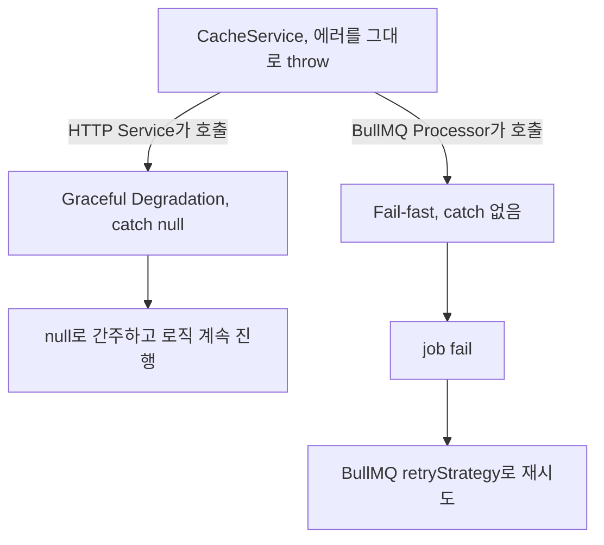

캐시(Redis)는 있으면 좋고 없어도 시스템이 돌아가야 하는 옵션 레이어다

근데 BullMQ 잡 안에서 캐시 저장이 조용히 실패하면 얘기가 달라진다

실패를 삼키면 재시도 자체가 불가능해진다

같은 `CacheService`를 HTTP 요청과 BullMQ Processor 양쪽에서 쓰는데, 에러가 났을 때 해야 할 일이 정반대다

## 어떻게 동작하나

원칙은 하나다, 서비스는 에러를 그대로 던지고 호출자가 컨텍스트에 맞게 처리한다

```typescript
// ✅ CacheService — 에러를 그대로 throw
async get(key: string): Promise<string | null> {
  return this.redis.get(key) // ReplyError 시 throw
}

// ❌ 서비스 내부에서 삼키면 BullMQ 호출부가 재시도 못 함
async get(key: string): Promise<string | null> {
  return this.redis.get(key).catch(() => null)
}
```

CacheService가 에러를 삼켜버리면 BullMQ Processor는 항상 성공으로 간주하고 넘어간다

재시도할 기회 자체가 사라진다

에러를 어떻게 처리할지 결정권은 서비스가 아니라 호출자한테 있어야 한다

### HTTP 컨텍스트, Graceful Degradation

Redis가 죽어도 사용자 응답은 끊기면 안 된다

```typescript
// 캐시 미스(null)와 Redis 장애(.catch → null)를 동일하게 처리
const cached = await this.cacheService.get(key).catch(() => null)
if (cached) return JSON.parse(cached)

// 캐시 없으면 원본 소스에서 데이터를 가져와 계속 진행
const data = await this.repository.findOne(id)
```

`cached === null`만 보면 캐시 미스인지 Redis 장애인지 코드상으로 구분이 안 된다

`.catch(() => null)`은 장애를 캐시 미스처럼 취급하겠다는 명시적 선택이다

캐시 없이도 로직이 계속 진행 가능한 컨텍스트에서만 쓸 수 있다

### BullMQ 컨텍스트, Fail-fast

Processor에서는 `.catch()`를 의도적으로 안 붙인다

```typescript
// Processor에서는 .catch() 없음, 의도적
await this.cacheService.set(key, JSON.stringify(data), TTL)
// 실패 시 job fail, BullMQ retryStrategy로 재시도

await this.someService.doWork() // 캐시 확인 후 실행
```

캐시 저장을 로직 앞에 두는 이유는 재시도할 때 캐시가 이미 끝나 있으면 이후 작업을 빠르게 통과시키기 위해서다

`.catch()`를 달면 캐시가 실패해도 이후 로직이 그냥 실행돼버린다

의도하지 않은 부작용으로 이어질 수 있다

### 연결 레벨, EventEmitter Error Guard

ioredis는 EventEmitter 기반이라 `on('error')`가 없으면 프로세스 자체가 죽는다

```typescript
client.on('error', (err: Error) => {
  logger.error('Redis 연결 에러', err.message)
  try {
    Sentry.captureException(err) // HTTP 컨텍스트 밖이라 Filter가 안 닿음, 직접 전송
  } catch {
    // Sentry 실패가 또 다른 uncaughtException을 유발하지 않도록
  }
})

retryStrategy: (times) => Math.min(times * 100, 3000)
// 재연결은 TCP 시도, Redis 명령 실행이 아니라서 과금 없음
```

`retryStrategy`가 없으면 연결이 한 번 끊긴 뒤로 모든 Redis 명령이 즉시 에러로 떨어진다

세 레이어를 표로 정리하면 이렇다

| 레이어 | 패턴 | 이유 |
|-------|------|------|
| Redis 클라이언트 초기화 | EventEmitter Error Guard | 연결 레벨 에러, AllExceptionFilter 밖 |
| HTTP Service | Graceful Degradation | UX 우선, 캐시 없어도 응답해야 함 |
| BullMQ Processor | Caller-decides + Fail-fast | 재시도 보장 |



## JARVIS에서 실제로 어떻게 썼나

JARVIS 에러 파이프라인에도 이 구분을 그대로 적용했다

캐시를 쓰는 HTTP 엔드포인트는 Graceful Degradation으로 캐시 없이도 응답이 나가게 하고, 캐시를 쓰는 BullMQ Processor는 Fail-fast로 캐시 저장 실패를 job fail로 넘겨 재시도가 돌게 했다

Redis 클라이언트는 `on('error')` 핸들러 안에서 Sentry로 바로 보낸다

BullMQ Processor는 HTTP 어댑터를 거치지 않아서 `AllExceptionFilter`가 여기까진 안 닿기 때문이다

## Gotcha

- `on('error')` 안의 Sentry 호출은 반드시 try-catch로 감싸야 한다, 안 그러면 핸들러 안에서 또 다른 uncaughtException이 날 수 있다
- `AllExceptionFilter`는 BullMQ에서 동작 안 한다, HTTP 어댑터가 없어서 Processor 에러는 Filter를 거치지 않는다
- `.catch()` 위치가 잘못되면 실패가 조용히 삼켜진다, 서비스 내부에 두면 BullMQ가 재시도 기회를 통째로 잃는다
- 장기 유지 TCP 연결 + EventEmitter 기반이면 `on('error')`가 필수다, Prisma나 axios처럼 Promise 기반 클라이언트는 `.catch()` 하나로 충분하다
