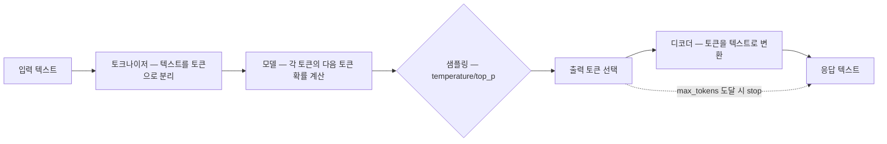

LLM을 쓰면서도 내부 동작을 모르면 막히는 지점이 있다

왜 긴 대화가 갑자기 잘리는지, 왜 비용이 어느 순간 확 올라가는지
토큰, 컨텍스트 윈도우, 샘플링 파라미터를 모르면 설정값만 봐서는 답이 안 나온다

공식 문서는 보통 "LLM은 대규모 텍스트로 학습된 언어 모델"이라는 식으로 설명하는데
이 정의로는 max_tokens나 temperature 같은 파라미터가 실제로 뭘 조절하는지 연결이 안 된다

원리부터 JARVIS 설정값까지 순서대로 정리했다

## 어떻게 동작하나

입력 텍스트를 토큰으로 자르고, 각 토큰의 다음 토큰을 예측하는 방식으로 텍스트를 생성한다
컨텍스트 윈도우 안에 있는 것만 "기억"하고, 넘어가면 잘린다



---

### 토큰이란

- 텍스트를 모델이 처리하는 최소 단위로 쪼갠 것
- 글자 수와 토큰 수는 다르다, 영어 1단어는 대략 1~2토큰, 한국어는 더 많이 쓴다
- "안녕하세요"는 대략 4~6토큰
- 비용은 입력 토큰과 출력 토큰을 합산해서 계산된다

공식 SDK로 토큰 수를 직접 셀 수도 있다

```python
import anthropic
client = anthropic.Anthropic()
response = client.messages.count_tokens(
    model="claude-opus-4-5",
    messages=[{"role": "user", "content": "Hello, Claude"}]
)
print(response.input_tokens)  # 10
```

JARVIS는 토큰 수를 직접 세는 대신 max_tokens 상한만 용도별로 나눠서 설정한다

```python
claude_chat_model: str = "claude-opus-4-5"
chat_max_tokens: int = 4096
claude_extraction_model: str = "claude-haiku-4-5-20251001"
extraction_max_tokens: int = 1024
```

채팅은 4096, 메모리 추출은 1024로 다르게 잡았다
모델도 채팅은 opus, 추출은 haiku로 나눴다, 비용과 응답 특성이 용도마다 다르기 때문

- 토큰: 모델이 처리하는 최소 텍스트 단위, 영어 단어나 한글 음절 단위로 쪼개짐
- 토크나이저: 텍스트를 토큰으로 변환하는 알고리즘
- input_tokens: 프롬프트(시스템 + 히스토리 + 유저 메시지) 토큰 수
- output_tokens: 모델이 생성한 응답의 토큰 수

### 컨텍스트 윈도우

- 모델이 한 번에 "볼 수 있는" 토큰의 최대 개수
- 윈도우 안의 내용만 기억하고, 넘어가면 앞부분이 잘린다
- claude-opus-4-5는 200K 토큰 컨텍스트를 지원한다
- 대화가 길어질수록 입력 토큰이 늘어나서 비용과 응답 속도에 영향을 준다

JARVIS는 대화 히스토리를 최근 20개로 제한해서 컨텍스트 윈도우를 아낀다

```typescript
const HISTORY_LIMIT = 20;
// 현재 유저 메시지를 저장하기 전에 히스토리를 먼저 조회 — context에 중복 포함 방지
const history = await this.messageRepository.findHistoryForInference(
    conversationId,
    HISTORY_LIMIT,
);
```

오래된 대화는 히스토리 대신 RAG(메모리) 검색으로 불러온다
전체 히스토리를 계속 들고 있지 않아도 맥락을 유지할 수 있는 구조다

- 컨텍스트 윈도우: 모델이 한 번에 처리할 수 있는 최대 토큰 수
- 히스토리: 이전 대화 메시지 목록, messages 배열로 전달
- 컨텍스트 초과: 토큰 수가 윈도우 한계를 넘으면 앞부분이 잘리는 것

### Prefill과 Decode

- Prefill은 입력 토큰을 한 번에 병렬로 처리하는 단계라 빠르다
- Decode는 출력 토큰을 하나씩 순차로 생성하는 단계라 느리다
- 스트리밍으로 글자가 하나씩 나오는 것처럼 보이는 이유가 Decode 단계 때문이다
- 긴 시스템 프롬프트를 캐싱하면 Prefill 비용을 줄일 수 있다 (Prompt Caching)

### 샘플링 파라미터 (temperature, top_p)

- temperature는 출력의 랜덤성을 조절한다, 0이면 항상 확률이 가장 높은 토큰만 고르고 값이 커질수록 다양해진다
- top_p(nucleus sampling)는 누적 확률 p까지의 토큰만 후보로 남긴다, temperature의 대안
- JARVIS는 temperature와 top_p를 따로 설정하지 않고 기본값을 쓴다

공식 예제는 temperature를 명시적으로 지정한다

```python
response = client.messages.create(
    model="claude-opus-4-5",
    max_tokens=1024,
    temperature=0.7,   # 0~1, 높을수록 창의적
    messages=[{"role": "user", "content": "시 한 편 써줘"}]
)
```

JARVIS 채팅 호출은 temperature를 지정하지 않는다

```python
kwargs = dict(
    model=self._cfg.claude_chat_model,
    max_tokens=self._cfg.chat_max_tokens,
    system=system,
    messages=messages,
)
# temperature 미설정 — 기본값(1.0) 사용
```

대화형 응답은 매번 똑같으면 부자연스러워서 기본값을 그대로 쓴다
반대로 메모리 추출처럼 구조화된 출력이 필요한 작업엔 temperature=0이 더 적합하다

- temperature: 출력 다양성 조절, 0이면 결정론적이고 높을수록 창의적
- top_p: 확률 분포 상위 p%의 토큰만 고려, temperature 대안
- stop_reason: 모델이 멈춘 이유, end_turn / max_tokens / tool_use 등

## 실제로 뭘 쓸 것인가

JARVIS 기준으로 정리하면

- 채팅은 opus + max_tokens 4096, 메모리 추출은 haiku + max_tokens 1024로 용도별 분리
- temperature는 채팅에서 기본값(1.0), 구조화 출력이 필요한 곳은 0으로 고정하는 게 맞음
- 히스토리는 최근 20개로 제한하고 나머지는 RAG 검색으로 대체

## 삽질한 것

max_tokens는 "최소 보장"이 아니라 "최대 허용"이라서, 답이 다 안 끝났는데 잘리는 경우가 있다

메모리 추출에서 `stop_reason == "max_tokens"`가 나오면 추출이 중간에 잘린 것이라 별도 에러로 처리해야 한다

```
❌ stop_reason 체크 없이 추출 결과를 그대로 저장
✅ stop_reason == "max_tokens"면 ExtractionError로 처리하고 재시도하거나 버림
```

한국어는 영어보다 토큰을 더 많이 쓴다

LLM 토크나이저가 영어 중심으로 설계돼 있어서, 정확히 측정한 수치는 아니지만 같은 내용이라도 한국어가 영어 대비 체감상 2~3배 정도 토큰을 더 쓰는 걸로 알려져 있다
JARVIS가 채팅 max_tokens를 4096으로 넉넉하게 잡은 것도 한국어 기준으로 여유를 확보하기 위해서다
