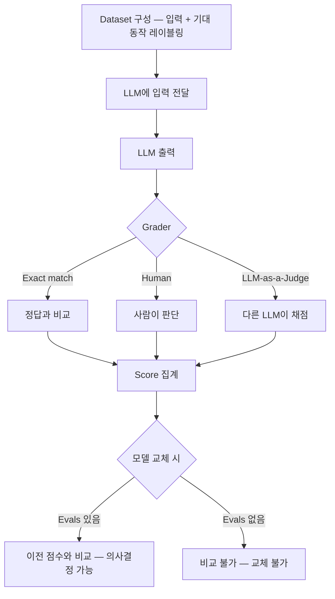

일반 소프트웨어는 테스트로 검증한다

```python
assert sort([3, 1, 2]) == [1, 2, 3]  # 정답이 하나, 통과/실패가 명확
```

LLM은 이 방식이 안 된다

```python
assert llm("이게 모순이야?") == ???  # 정답이 뭔지 정의가 안 됨
                                      # 같은 질문에 매번 다른 표현으로 답함
```

Evals(Evaluations)는 이걸 대신한다

사람이 정답을 직접 정의한 테스트 케이스를 만들고
LLM이 그 케이스들에서 몇 퍼센트나 올바르게 동작하는지 점수를 낸다

## 왜 필요한가

LLM이 판단한 게 맞는지 틀린지 확인할 방법이 없으면
모델을 바꿀 때 좋아진 건지 나빠진 건지 알 수가 없다

예를 들어 LLM한테 이렇게 물어본다고 하면

```
"서울 거주" 메모리가 있는데 "광주로 이사했어"가 새로 들어왔어
기존 메모리 교체해야 해?
```

Claude A는 "교체해야 함"이라고 답한다
더 좋은 Claude B로 바꿨더니 "그냥 추가하면 됨"이라고 답한다

어느 쪽이 맞는 건지 알 방법이 없다
비교할 정답(Ground Truth)이 없기 때문이다

Evals가 있으면 달라진다

```
정답 케이스 100개를 미리 만들어둠
  → Claude A 테스트: 87개 정답 (87점)
  → Claude B 테스트: 91개 정답 (91점)
  → "B가 낫다, 바꿔도 된다" ← 숫자로 비교 가능
```

Evals 없이 모델을 교체하는 건 눈 감고 운전하는 것과 비슷하다

### 전제 개념

**Ground Truth**
실제 세상에 존재하는 정답, 모델 출력과 비교할 때 기준이 되는 값

- 예) 입력: 고양이 사진 → Ground Truth: "고양이"
- Ground Truth가 없으면 LLM이 맞게 했는지 틀리게 했는지 판단 불가
- 창의적 글쓰기, 코드 리뷰, 감정 분석처럼 "정답이 하나가 아닌 작업"은 Ground Truth 자체를 만들기 어렵다

**Label과 Backbone**

- Label(라벨): 사람이 데이터에 붙인 태그, Ground Truth를 만드는 행위의 결과물. 실무에서는 라벨 = Ground Truth처럼 혼용하지만 엄밀히는 라벨링이 잘못될 수 있음(휴먼 에러)
- Backbone(백본): 나머지 모델이 올라타는 기반 네트워크, BERT나 ResNet처럼 feature를 추출하는 메인 구조. Ground Truth·Label이 평가 쪽 개념이라면 Backbone은 모델 구조 쪽 개념

**Offline Evaluation vs Online Evaluation**

- Offline: 배포 전에 미리 만든 테스트셋으로 평가, 안전하지만 실제 사용 패턴과 다를 수 있음
- Online: 실제 사용자 트래픽으로 A/B 테스트, 정확하지만 나쁜 모델이 실사용자에게 노출됨
- Evals는 주로 Offline 평가를 가리킴, 테스트셋이 실제 사용 패턴을 대표하지 못하면 Offline 점수가 높아도 실서비스에서 문제가 생길 수 있다

참고로 temperature=0으로 설정해도 LLM 출력이 완전히 고정되진 않는다
floating point 차이, 하드웨어 차이로 미세한 변동이 있을 수 있어서다
실용적으로는 거의 동일해서 "결정론적"이라고 부르는 경우가 많다

## 어떻게 동작하나

LLM을 평가하는 방법은 크게 5가지로 나뉜다

### 1. Performance Metrics
BLEU, ROUGE, BERTScore 같은 수치 지표로 점수를 내는 방법
"출력이 정답과 얼마나 가까운가"를 숫자로 표현한다

### 2. Benchmarks
MMLU, GSM8k 같은 표준화된 시험 문제집으로 평가하는 방법
"이 모델이 수학을 잘 하는가", "상식이 있는가"를 측정한다

### 3. Human Evaluation
사람이 직접 LLM 출력을 보고 좋다/나쁘다 판단하는 방법
가장 정확하지만 시간과 비용이 많이 든다
크라우드소싱으로 진행하기도 한다 (예: Chatbot Arena, 두 모델 출력을 보고 어느 쪽이 나은지 사람들이 투표)

### 4. Model-based Evaluation (LLM-as-a-Judge)
다른 LLM이 출력을 채점하는 방법, 사람 대신 LLM을 평가자로 쓴다
편리하지만 채점자 LLM의 편향이 그대로 반영된다

LLM-as-a-Judge 문제점

- Positional bias, 먼저 나온 선택지를 더 좋다고 채점하는 경향
- Self-consistency, 자기 출력을 스스로 평가하면 자기 편향
- 채점자 LLM을 교체하면 점수 기준 자체가 달라짐

MT-Bench 논문(Zheng et al., 2023)이 이 문제를 처음 체계화했다

### 5. Evaluation Frameworks
위 방법들을 코드로 쉽게 쓸 수 있게 해주는 도구들

| 도구 | 특징 |
|------|------|
| DeepEval | 범용 LLM 평가 프레임워크 |
| RAGAs | RAG 파이프라인 전용 평가 |
| Phoenix | 모니터링 + 평가 통합 |

### Evals 구성 3요소

```
1. Dataset   — 테스트 케이스 목록 (입력 + 기대 동작)
2. Grader    — 실제 출력이 기대 동작과 일치하는지 판단
3. Score     — 전체 케이스 중 통과 비율
```



## JARVIS에서는 아직

JARVIS는 지금 정식 Evals 파이프라인을 갖추고 있지 않다

이 개념이 필요해진 계기는 메모리 의미론적 모순 감지를 설계하던 중이었다
"서울 거주"와 "광주로 이사했어"처럼 기존 메모리와 새 메모리가 충돌할 때 LLM한테 모순인지 물어보는 방식을 쓰는데
그 판단이 맞는지 확인할 기준이 없다는 문제를 설명하려면 Evals 개념이 필요했다

Dataset을 어떻게 구성할지는 아직 정하지 못했다
PMF 이후 메모리 오작동 리포트가 반복되기 시작하면, 그때가 Ground Truth 케이스를 모아 Evals를 실제로 붙여볼 시점이라고 본다

## 관련 연구

- "Judging LLM-as-a-Judge with MT-Bench and Chatbot Arena" (Zheng et al., 2023), LLM-as-a-Judge 패턴의 편향과 한계를 처음 체계화한 논문
- OpenAI Evals (2023, 오픈소스), LLM 평가 프레임워크. Dataset + Grader 구조의 실제 구현체
