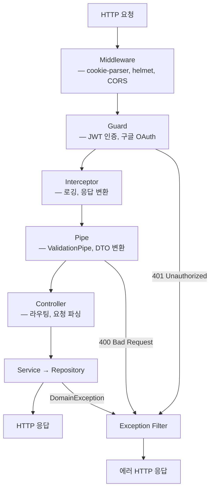

NestJS 공식 문서는 요청 흐름을 이렇게 설명한다

Middleware → Guards → Interceptors (before) → Pipes → Controller → Interceptors (after) → Exception Filters

순서는 맞는데 각 레이어가 실제로 뭘 해야 하는지는 안 나온다

Guard가 Controller보다 먼저 실행된다는 걸 모르면 인증 로직을 엉뚱한 위치에 넣는 실수를 하고, Exception Filter가 언제 개입하는지 모르면 에러가 어디서 잡히는지 추적이 안 된다

## 어떻게 동작하나

요청 → Middleware → Guard → Interceptor → Pipe → Controller → Exception Filter(에러 시)



### Middleware

Express 미들웨어와 동일하게 요청/응답 객체에 접근하는 레이어

모든 요청에 적용하거나 특정 경로만 지정할 수 있다

- helmet, HTTP 보안 헤더 설정으로 XSS·clickjacking 방어
- cookie-parser, `req.cookies`로 쿠키 파싱
- CORS, 다른 도메인에서 오는 요청 허용 설정

```typescript
private init(): void {
    this.app.use(helmet());
    this.app.use(cookieParser());
    this.app.enableCors({
        origin: this.config.getOrThrow<string>('app.webUrl'),
        credentials: true,
    });
}
```

### Guard

요청을 Controller까지 보낼지 여기서 끊을지 결정하는 레이어

`CanActivate` 인터페이스를 구현해서 `true`를 반환하면 통과, `false`나 예외를 던지면 401/403으로 끝난다

JARVIS는 `JwtAuthGuard`로 JWT 인증을, `GoogleAuthGuard`로 OAuth 시작을 처리한다

```typescript
@Injectable()
export class JwtStrategy extends PassportStrategy(Strategy, 'jwt') {
  constructor(
    private readonly authService: AuthService,
    @Inject(jwtConfig.KEY) jwtConfig: JwtConfig,
  ) {
    super({
      jwtFromRequest: ExtractJwt.fromAuthHeaderAsBearerToken(),
      secretOrKey: jwtConfig.accessSecret,
      ignoreExpiration: false,
    });
  }

  async validate(payload: JwtPayload) {
    const user = await this.authService.validateAccessToken(payload.sub);
    if (!user) throw new UnauthorizedException();
    return user;
  }
}
```

`validate()`가 반환한 값이 `req.user`에 그대로 주입되고, Controller에서는 `@CurrentUser()` 데코레이터로 꺼내 쓴다

### Pipe

요청 데이터를 변환하고 유효성을 검사하는 레이어

`ValidationPipe`가 class-validator 데코레이터 기반으로 DTO를 검증하고, 통과 못하면 400으로 떨어진다

JARVIS는 `CoreModule`에서 `APP_PIPE` 토큰으로 `ValidationPipe`를 전역 등록한다

`app.useGlobalPipes()` 대신 `APP_PIPE`를 쓰는 이유는 DI 컨테이너 안에서 만들어야 Logger 같은 다른 의존성도 같이 주입받을 수 있어서다

### Exception Filter

모든 예외를 잡아서 HTTP 응답으로 바꾸는 레이어

`@Catch()`로 잡을 예외 타입을 지정할 수 있고 비워두면 전부 잡는다

`ArgumentsHost`로 현재 요청이 HTTP인지 WebSocket인지 구분해서 응답 형식을 맞춘다

JARVIS의 `AllExceptionFilter`는 DomainException, Prisma 에러, HttpException을 전부 한 곳에서 처리한다

```typescript
@Catch()
export class AllExceptionFilter implements ExceptionFilter {
  catch(exception: unknown, host: ArgumentsHost): void {
    const errorInfo = this.resolveErrorInfo(exception);

    const responseBody = {
      timestamp: new Date().toISOString(),
      path: httpAdapter.getRequestUrl(request),
      error: { code: errorInfo.code, message: errorInfo.message },
    };

    httpAdapter.reply(response, responseBody, errorInfo.httpStatus);
    this.logError(request, errorInfo, exception);
  }

  private resolveErrorInfo(exception: unknown): ErrorInfo {
    if (exception instanceof DomainException) { ... }
    if (exception instanceof SystemException) { ... }
    if (exception instanceof Prisma.PrismaClientKnownRequestError) { ... }
    if (exception instanceof HttpException) { ... }
    return { /* 500 fallback */ };
  }
}
```

분기 결과는 이렇게 나뉜다

- DomainException, 해당 HTTP 상태코드 + 도메인 에러 코드
- Prisma P2025 (Record not found), 404
- Prisma P2002 (Unique constraint), 409
- 나머지, 500 + Sentry 캡처

## 삽질한 것

**SSE 스트리밍 시작 후 던진 예외는 AllExceptionFilter가 못 잡는다**

`res.flushHeaders()`가 호출된 순간 HTTP 헤더가 이미 전송돼서 상태 코드를 더는 바꿀 수 없기 때문

그래서 헤더를 커밋하기 전에 소유권 체크부터 끝내야 한다

JARVIS는 `message.controller.ts`에서 `flushHeaders()`를 부르기 전에 `getConversationOrThrow()`로 소유권을 먼저 확인한다

**`APP_FILTER`와 `useGlobalFilters()`는 DI 여부가 다르다**

```typescript
// 수동 생성이라 HttpAdapterHost 같은 의존성을 주입받지 못함
app.useGlobalFilters(new AllExceptionFilter())
```

`APP_FILTER` 토큰으로 등록하면 DI 컨테이너가 인스턴스를 만들어서 필요한 의존성을 전부 주입받을 수 있다

`AllExceptionFilter`는 `HttpAdapterHost`를 주입받아야 해서 JARVIS는 `APP_FILTER` 쪽을 쓴다
