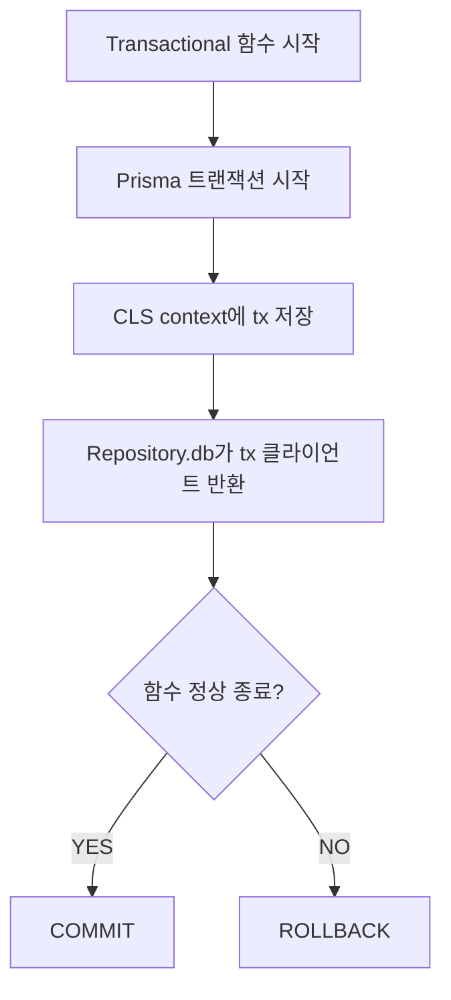

delete 성공 후 create가 실패하면 데이터가 반쪽만 남는다

트랜잭션 없이는 이 원자성을 보장할 방법이 없다

`@nestjs-cls/transactional`의 `@Transactional()`은 이 문제를 데코레이터 하나로 풀어준다

공식 문서는 "CLS 컨텍스트로 Prisma 트랜잭션을 전파한다"고만 설명하는데, CLS가 뭔지도 BullMQ 같은 비 HTTP 컨텍스트에서 동작하는지도 나오지 않는다

## 어떻게 동작하나

`@Transactional()`이 CLS(Continuation Local Storage)에 트랜잭션 컨텍스트를 주입하면, 같은 async 실행 체인에서 호출되는 모든 Repository가 자동으로 같은 tx 클라이언트를 쓴다



Repository 쪽 코드는 CLS에 트랜잭션이 있는지만 확인한다

```typescript
export abstract class BaseRepository {
  constructor(protected readonly txHost: PrismaTransactionHost) {}

  protected get db() {
    return this.txHost.tx; // CLS에 tx 있으면 tx 클라이언트, 없으면 일반 prisma
  }
}
```

`@Transactional()` 함수 안에서 `this.db`를 쓰면 tx 클라이언트가 잡히고, 밖에서 쓰면 일반 prisma 클라이언트가 잡힌다

Repository 코드는 자기가 트랜잭션 안에 있는지 신경 쓸 필요가 없다

### BullMQ에서도 동작하는 이유

BullMQ worker는 HTTP 요청이 아니라서 CLS 미들웨어가 실행되지 않는다

그런데도 동작하는 이유는 `@Transactional()` 내부가 `cls.run({ ifNested: 'inherit' })`을 직접 호출해서 컨텍스트를 스스로 만들기 때문

HTTP 미들웨어에 의존하지 않고 데코레이터 자체가 컨텍스트 생성 책임을 진다

## JARVIS에서 실제로 어떻게 썼나

Refresh Token Rotation에서 구 토큰 삭제와 신규 토큰 생성이 같이 성공하거나 같이 실패해야 하는 지점에 붙였다

```typescript
@Transactional()
private async rotate(oldToken: string): Promise<TokenPair> {
  const stored = await this.refreshTokenRepository.delete(oldToken);

  if (stored.expiresAt < new Date()) {
    throw new DomainException(DOMAIN_ERRORS.AUTH_REFRESH_TOKEN_EXPIRED);
  }

  return this.generateTokenPair(stored.userId);
}
```

공식 예제와 다른 점 두 가지

- `private` 메서드에 직접 붙임, `public`인 `rotateRefreshToken()`이 이 함수를 호출하는 구조
- 세션 무효화(`handleReuseDetected`)는 tx 밖에서 실행, 롤백에 말려들면 보안 조치 자체가 취소돼버림

```typescript
async rotateRefreshToken(oldToken: string): Promise<TokenPair> {
  try {
    return await this.rotate(oldToken);
  } catch (e) {
    if (e instanceof DomainException && e.code === DOMAIN_ERRORS.AUTH_INVALID_REFRESH_TOKEN.code) {
      await this.handleReuseDetected(oldToken); // tx 완전히 끝난 뒤 실행
    }
    throw e;
  }
}
```

BullMQ 쪽은 메모리 추출 job에서 같은 패턴을 쓴다

메시지에서 뽑아낸 기억 여러 개를 저장할 때, 하나라도 실패하면 전부 롤백돼야 부분 저장으로 데이터가 꼬이지 않는다

```typescript
@Transactional() // BullMQ worker에서도 동작
async process(job: Job<MemoryExtractJobData>): Promise<void> {
  const extracted = await this.inferenceClient.extractMemories({ userId, messages });
  await Promise.all(extracted.map((m) => this.memoryRepository.create(m)));
}
```

## 삽질한 것

**같은 클래스 안에서 `this.method()`로 `@Transactional()` 메서드를 직접 호출하면 AOP가 안 먹는다**

NestJS의 AOP는 DI 컨테이너가 만들어준 프록시를 거쳐야 동작하는데, `this.method()` 직접 호출은 그 프록시를 우회한다

트랜잭션이 필요한 함수는 항상 외부(다른 클래스나 다른 public 메서드)에서 호출되도록 구조를 잡아야 한다

**PostgreSQL은 트랜잭션 안에서 에러 한 번 나면 그 뒤 쿼리를 전부 거부한다**

트랜잭션이 aborted state로 들어가서 커밋도 롤백 전까지는 후속 쿼리가 안 먹힌다

구글 로그인에서 유저를 찾거나 새로 만드는 함수에 `@Transactional()`을 안 붙인 이유가 이거다

실패 시 catch 블록에서 재조회 쿼리를 날려야 하는데, tx 안에 있으면 그 재조회 자체가 막힌다

catch 블록에서 DB 재쿼리가 필요한 함수는 애초에 tx 밖에 둬야 한다

