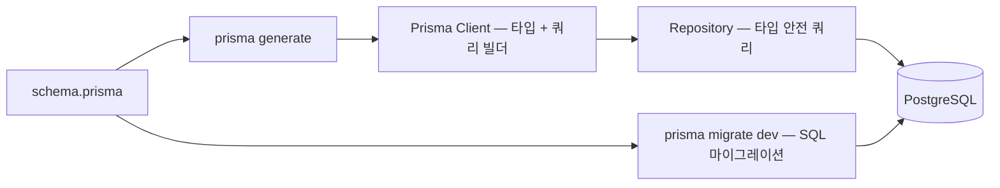

순수 SQL은 컬럼명 오타를 런타임에서야 발견한다

Prisma는 `schema.prisma`에서 TypeScript 타입을 자동 생성해서 컴파일 타임에 걸러낸다

마이그레이션 관리, 타입 안전 쿼리, 관계 조회를 스키마 파일 하나로 묶는 게 Prisma가 하는 일이다

## 어떻게 동작하나

`schema.prisma`를 정의하면 `prisma generate`가 TypeScript 클라이언트를 만들고, Repository는 그 클라이언트로 타입 안전하게 쿼리한다



모델 정의 규칙

- 모델명은 PascalCase, 테이블명은 snake_case (`@@map`으로 분리)
- 관계는 `@relation` 데코레이터 + `onDelete` 정책 명시
- soft delete는 `isDeleted`, `deletedAt` 컬럼으로 처리

```prisma
model User {
  id           String    @id @default(uuid())
  email        String    @unique
  isDeleted    Boolean   @default(false)
  deletedAt    DateTime?

  refreshTokens RefreshToken[]

  @@map("users")
}

model RefreshToken {
  id        String   @id @default(uuid())
  userId    String
  token     String   @unique
  expiresAt DateTime

  user User @relation(fields: [userId], references: [id], onDelete: Cascade)

  @@index([userId])
  @@map("refresh_tokens")
}
```

공식 예제는 `autoincrement()` id를 쓰는데, 여기서는 `uuid()`로 바꿨다

분산 환경에서 여러 서버가 동시에 insert해도 id 충돌이 안 나기 때문이다

`@@index([userId])`도 직접 추가했다

Prisma는 외래키에 인덱스를 자동으로 안 만들어준다, 안 넣으면 `findFirst` 같은 쿼리가 풀 스캔을 탄다

### migrate dev vs db push

- `migrate dev` — 마이그레이션 파일 생성 + 적용, 변경 이력이 남는다
- `db push` — 이력 없이 스키마를 즉시 반영, 개발 초기 빠른 이터레이션용

이력 추적과 롤백이 필요해서 `migrate dev`를 골랐다

컨테이너 시작 시점엔 `migrate deploy`로 미적용 마이그레이션만 적용한다

```dockerfile
CMD ["sh", "-c", "prisma migrate deploy && node dist/main"]
```

### findUnique vs findFirst

`findUnique`는 `@id`나 `@unique` 필드만 조건으로 받는다

`@unique`가 아닌 필드로 조회하려면 `findFirst`를 써야 한다

```typescript
// @unique 필드 — findUnique
await db.refreshToken.delete({ where: { token } });

// @unique 아닌 필드 — findFirst
await db.memory.findFirst({ where: { id, userId } });
```

`findFirst`는 인덱스가 없으면 풀 스캔으로 이어진다

`@@index([userId])`를 빼먹으면 여기서 성능이 새는 지점이 된다

### N+1과 include

목록 조회 후 각 항목마다 연관 데이터를 따로 조회하면 N+1이 생긴다

100개를 조회하면 쿼리가 101번 나간다

```typescript
// N+1 — conversations 조회 후 각각 messages 조회
const conversations = await prisma.conversation.findMany();
for (const conv of conversations) {
  await prisma.message.findMany({ where: { conversationId: conv.id } });
}

// include로 한 번에
const conversations = await prisma.conversation.findMany({
  include: { messages: true },
});
```

## 실제로 뭘 쓸 것인가

JARVIS에서는 `RefreshToken` 삭제처럼 유니크 필드 조회는 `findUnique`, 메모리 조회처럼 유니크가 아닌 조건은 `findFirst`로 나눠 썼다

외래키 컬럼에는 예외 없이 `@@index`를 붙였다

Prisma가 자동으로 챙겨주지 않는 부분이라 빠뜨리면 나중에 쿼리 성능에서 티가 난다

메모리 추출처럼 여러 건을 한 번에 저장하는 로직은 `include`로 N+1을 피하고, 관계 조회가 필요한 곳마다 이 패턴을 반복 적용했다

## 삽질한 것

**Prisma CLI가 로컬 개발 환경에서 크래시난 적이 있다**

원인은 개발 도구가 `NODE_OPTIONS`에 임시 파일 경로를 주입해서, Prisma 자식 프로세스가 그 파일을 못 찾고 죽는 것이었다

`unset NODE_OPTIONS`를 Prisma CLI 명령 앞에 붙이면 해결된다

**외래키에 인덱스가 자동으로 안 생긴다**

`@relation`을 걸어도 Prisma가 인덱스를 알아서 추가해주지 않는다

외래키로 쓰는 컬럼마다 `@@index`를 직접 붙여야 한다, 안 그러면 조회가 늘어날수록 느려지는 걸 나중에야 알아차리게 된다

**빌드 시점에 `DATABASE_URL`이 없으면 `prisma generate`가 실패한다**

실제 DB에 연결하는 건 아닌데도 환경변수 존재 자체는 검증한다

빌드용 더미 값(`postgresql://x:x@localhost:5432/x`)을 넣어주면 넘어간다
