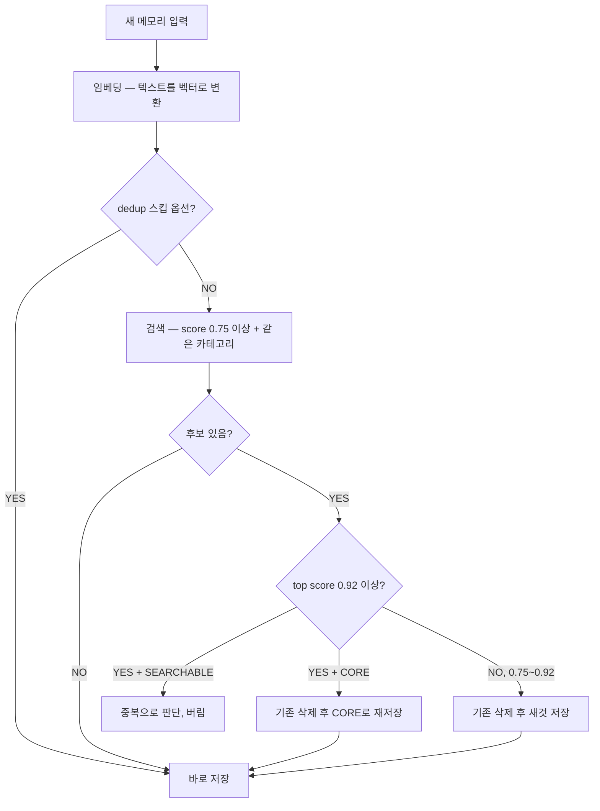

## 왜 필요한가

벡터 검색에서 두 텍스트가 얼마나 비슷한지는 코사인 유사도로 잰다

0에서 1 사이 숫자 하나로 나온다

문제는 이 숫자 하나로 서로 다른 세 가지 판단을 내려야 한다는 것

- 채팅 중 지금 질문과 관련 있는 메모리를 가져올 때
- 새 메모리를 저장하기 전에 기존 메모리와 같은 주제인지 확인할 때
- 같은 주제라면 사실상 같은 내용인지 최종 판정할 때

"관련 있다"와 "같은 주제다"와 "사실상 동일하다"는 요구하는 확신의 정도가 다르다

기준을 하나로 통일하면 둘 중 하나는 반드시 망가진다

너무 낮게 잡으면 전혀 다른 메모리를 중복으로 판단해서 새 정보를 버리고
너무 높게 잡으면 같은 내용이 계속 중복 저장되어 노이즈가 쌓인다

JARVIS 메모리 시스템은 그래서 threshold를 세 개로 나눴다

| threshold | 값 | 쓰이는 곳 | 역할 |
|-----------|-----|----------|------|
| score | 0.7 | 채팅 RAG 검색 | 이 이하면 컨텍스트에 안 넣음 |
| contradiction | 0.75 | 메모리 저장 시 후보 검색 | 이 이상이면 같은 주제로 보고 dedup 판정 시작 |
| dedup | 0.92 | 메모리 저장 시 최종 판정 | 이 이상이면 사실상 동일로 보고 skip |

## 어떻게 동작하나

코사인 유사도는 두 벡터 사이의 각도로 잰다

크기가 아니라 방향을 비교한다는 게 핵심이다

"나는 서울에 산다"와 "나는 서울에 살고 있으며 10년째 거주 중이다"는 문장 길이가 완전히 다르다

유클리드 거리로 재면 다르게 나오지만 코사인으로 재면 거의 1.0에 가깝게 나온다

의미 검색에 코사인을 쓰는 이유다

```
1.0  — 완전히 같은 방향 (의미 동일)
0.92 — 사실상 동일          ← dedup threshold
0.75 — 같은 주제권          ← contradiction threshold
0.70 — 느슨하게 관련        ← score threshold
0.00 — 직각 (전혀 다른 주제)
```

새 메모리가 들어왔을 때 흐름은 이렇게 갈라진다



세 threshold는 값 하나만 다른 게 아니라 검색 대상 자체가 다르다

score는 채팅 시점에 카테고리 상관없이 관련성만 본다

contradiction과 dedup은 저장 시점에 같은 user, 같은 카테고리 안에서만 후보를 찾는다

## JARVIS에서 실제로 어떻게 썼나

채팅 중 메모리를 가져올 때는 score threshold 이하를 아예 결과에서 제외한다

```python
# app/chat/service.py
response = await qdrant.query_points(
    collection_name=MEMORIES_COLLECTION,
    query=vector,
    query_filter=Filter(
        must=[FieldCondition(key="user_id", ...)],
        must_not=[FieldCondition(key="tier", match=MatchValue(value="ARCHIVED"))],
    ),
    limit=cfg.qdrant_top_k,
    score_threshold=cfg.qdrant_score_threshold,  # 0.7
    with_payload=True,
)
```

새 메모리를 저장할 때는 contradiction threshold로 먼저 후보를 좁히고

```python
# app/memory/service.py — index_memory()
candidates = await qdrant.search(
    collection_name=MEMORIES_COLLECTION,
    query_vector=vector,
    query_filter=Filter(
        must=[
            FieldCondition(key="user_id", match=MatchValue(value=request.user_id)),
            FieldCondition(key="category", match=MatchValue(value=request.category)),
        ]
    ),
    limit=1,
    score_threshold=cfg.qdrant_contradiction_threshold,  # 0.75
    with_payload=True,
)
```

찾아온 후보의 score와 tier를 보고 최종 판정한다

```python
if candidates:
    top = candidates[0]

    if top.score >= cfg.qdrant_dedup_threshold:  # 0.92 이상
        tier = (top.payload or {}).get("tier", "SEARCHABLE")
        if tier != "CORE":
            return  # SEARCHABLE 중복 — 버림
        await _try_delete_point(qdrant, top.id)  # CORE 충돌 — 내용 갱신, 핀 유지
    else:
        await _try_delete_point(qdrant, top.id)  # 0.75~0.92 — 같은 주제 다른 내용, 교체
```

dedup이 contradiction보다 낮아지면 안 되기 때문에 설정값 자체에 검증을 걸어뒀다

```python
# app/core/config.py
qdrant_score_threshold: float = 0.7
qdrant_dedup_threshold: float = 0.92
qdrant_contradiction_threshold: float = 0.75

@model_validator(mode="after")
def check_thresholds(self) -> "Settings":
    if self.qdrant_dedup_threshold <= self.qdrant_contradiction_threshold:
        raise ValueError(...)
    return self
```

두 값이 역전되면 dedup 검색 자체가 무의미해지니 앱이 아예 시작을 안 하게 막아둔 것

## 삽질한 것

0.92라는 dedup threshold가 경험적으로 맞는 값인지 확인하려고 골든 데이터셋 20쌍을 직접 만들어서 실측했다

결과가 예상과 달랐다

```
dedup 쌍 유사도 범위:          0.6143 ~ 0.9258
contradiction 쌍 유사도 범위:  0.5892 ~ 0.7426

→ 두 범위가 겹친다
```

"비흡연자"와 "흡연자임"처럼 뜻이 정반대인 문장 쌍이 0.7426으로, dedup 쌍들의 대부분보다 오히려 높게 나왔다

코사인 유사도는 의미의 방향을 재는 것이지 사실이 모순인지를 재는 게 아니라서 생기는 일이다

같은 도메인(흡연 여부) 안에서는 반대 상태여도 벡터 방향 자체는 가깝게 잡힌다

threshold를 아무리 조정해도 이 겹침은 구조적으로 못 없앤다

낮추면 모순 쌍이 중복으로 오분류되고 높이면 진짜 중복 쌍이 신규로 오분류된다

PREFERENCE, ROUTINE 카테고리는 상황이 더 나빴다

"비흡연자"와 "담배를 안 피움"처럼 명백히 같은 뜻인 문장 쌍이 유사도 0.27로 나왔다

threshold 0.75는커녕 unrelated 구간에 더 가까운 수치다

이 카테고리는 embedding만으로는 dedup 판정 자체가 불가능하다는 결론을 내리고

속성 키(attribute_key)를 LLM이 따로 뽑아서 정확히 일치하는지 비교하는 경로를 추가했다

벡터는 관련성 판단에만 쓰고 정확한 사실 비교는 별도 경로로 분리한 셈이다

실제 프로덕션에서도 이 겹침 때문에 버그가 하나 났다

유저가 "광주로 이사했어"라고 하면 기존 CORE 메모리("서울에 거주함")를 새 정보로 갱신해야 하는데

두 문장의 유사도가 dedup threshold를 넘어서 그냥 중복으로 skip 되고 새 정보가 조용히 버려졌다

원인은 dedup 판정 이후 tier가 CORE인 경우를 따로 분기하지 않았던 것

같은 SEARCHABLE 메모리처럼 취급해서 버린 게 문제였다

CORE와 SEARCHABLE을 dedup 판정 이후 단계에서 분기하도록 고치고 나서야 해결됐다

threshold 값 자체보다 "그 값을 넘었을 때 뭘 할지"를 데이터 성격별로 따로 설계하지 않은 게 진짜 원인이었다
